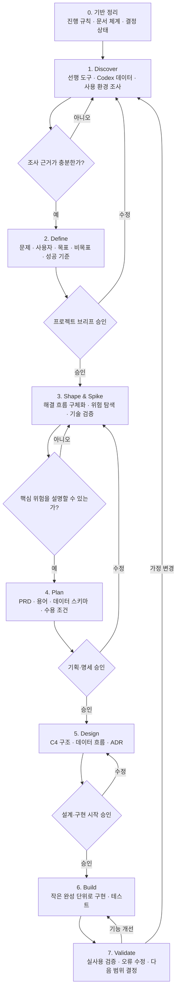

# 프로젝트 진행 방법론

공통 개발·Git·검증·안전 규약은 [CONTRIBUTING](CONTRIBUTING.md)을 따른다. 이 문서는 Kerbe의 제품 개발 단계와 방법론을 설명한다. 작업별 재개 상태는 [.ai/tasks/docs-cli-design.md](.ai/tasks/docs-cli-design.md)에 둔다.

상태: 사용 중

이 문서는 코덱스 사용량 추적 프로젝트를 아이디어 탐색부터 구현까지 어떤 순서로 진행할지 정의한다.

## 기본 방법

하나의 방법론을 그대로 사용하지 않고 다음 방식을 조합한다.

- [Double Diamond](https://www.designcouncil.org.uk/resources/framework-for-innovation/): 문제를 넓게 조사하고 핵심 문제를 좁혀 확정한다.
- [Shape Up](https://basecamp.com/shapeup/1.5-chapter-06): 문제, 해결 방향, 위험, 제외 범위를 정리한다.
- [PRD](https://www.atlassian.com/agile/product-management/requirements/): 목표, 요구사항, 성공 기준을 명세한다.
- [Technical Spike](https://www.agilealliance.org/wp-content/uploads/2017/08/AgileExtension_V2-Member-Copy.pdf): 불확실한 기술만 짧게 실험해 검증한다.
- [C4 Model](https://c4model.com/): 시스템 구조와 데이터 흐름을 설계한다.
- [ADR](https://martinfowler.com/bliki/ArchitectureDecisionRecord.html): 중요한 기술 결정과 이유를 기록한다.

## 전체 진행 도식도

## 단계별 결과물

| 단계 | 확인할 내용 | 결과물 |
|---|---|---|
| 기반 정리 | 진행 규칙과 승인 지점 | `PROCESS.md` |
| Discover | 사실, 선행 사례, 데이터 구조, 미확인 사항 | `RESEARCH.md`, `OPEN_QUESTIONS.md` |
| Define | 문제, 사용자, 목표, 범위, 완료 기준 | `PROJECT.md` |
| Shape & Spike | 해결 흐름, 위험, 실험 결과 | 연구 기록과 결정 제안 |
| Plan | 기능·데이터 요구사항과 검증 조건 | PRD, `SCHEMA.md` |
| Design | 시스템 구조와 주요 기술 선택 | C4 도식, ADR |
| Build | 실행 가능한 기능과 테스트 | 코드와 테스트 |
| Validate | 실사용 결과와 다음 개선점 | 검증 기록, 다음 계획 |

## 단계별 판단

Kerbe의 단계별 제품 산출물과 승인 이력은 위 도식과 DECISIONS에 보존한다. 승인 범위와 재승인 경계, 사실·가설·검증의 구분은 [CONTRIBUTING](CONTRIBUTING.md)을 따른다. 이 도식은 이미 승인된 작업에 반복 승인을 추가하는 절차가 아니다.

## 현재 위치

2026-09-18 후속 진행 방향은 사용자 승인 D-059와 [ROADMAP.md](ROADMAP.md)를 따른다. **1. 문서·검증 관리의 정적 대조를 완료**했으며 [불일치·검증 공백](STATE_AUDIT_2026-09-18.md)을 남겼다. 테스트 재실행 완료는 아니다. 2단계는 철학 확정 후 명령·출력 설계가 남았고, 3단계 병목 조사는 미착수다. 아래 도식과 체크리스트는 기존 v1 이력이다.

후속 순서: 문서·검증 관리 → CLI 규칙 정의 → 유지보수 조사 → CLI 규칙 적용 → 기능 개발. 1번 이후 2·3번은 병행 가능하며 3번은 제품 코드 변경 없는 조사다. 4번은 2번 규칙을 3번 기술 방향으로 적용한다. 단계별 산출물·완료 기준은 ROADMAP에서 관리하고, 신규 기능 사양을 이번 승인에 포함시키지 않는다.

핵심 Build와 실제 Windows·비공개 GitHub 환경의 v1 Validate를 완료했다.

## Build 진행

- [x] Python src-layout과 기본 패키지
- [x] HMAC project·thread·turn·event 식별자
- [x] Git remote 정규화와 origin·unique·ambiguous 선택
- [x] 첫 단위 테스트
- [x] JSONL token parser와 lifecycle delta
- [x] SQLite lineage adapter와 project attribution
- [x] outbox·ledger·read model
- [x] CLI collect·doctor·report·sync
- [x] project list·unresolved·link·alias
- [x] 로컬 bare remote 기반 다기기 acceptance
- [x] 실제 Windows Credential Manager acceptance
- [x] 비공개 GitHub 합성 장부 smoke
- [x] Windows·Ubuntu GitHub Actions CI
